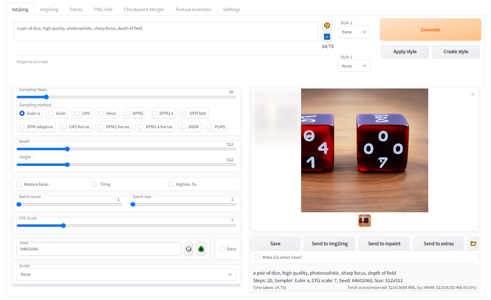

[batvbs](https://github.com/batvbs)使用[DeepL](https://www.deepl.com/translator)进行初步翻译，人工修正部分错误。

## 稳定扩散的网页用户界面

一个基于Gradio库的稳定扩散的浏览器界面。



查看[自定义脚本](https://github.com/AUTOMATIC1111/stable-diffusion-webui/wiki/Custom-Scripts) 维基页面，了解用户开发的额外脚本。

## 特点
[带有图片的详细功能展示](https://github.com/AUTOMATIC1111/stable-diffusion-webui/wiki/Features):

- 原始的txt2img和img2img模式
- 一键安装和运行脚本（但你仍然必须安装python和git）。
- 画外画
- 画中画
- 颜色素描
- 提示矩阵
- 稳定的漫射升格
- 注意，指定模型应该更加注意的文本部分

     - 一个穿 ((礼服)) 的男人 - 将更多地关注礼服
     - 一个穿 (礼服:1.21) 的男人 - 替代句法
     - 选择文本并按 ctrl+↑ 或 ctrl+↓ 自动调整对所选文本的关注（代码由匿名用户提供）
- Loopback，多次运行img2img处理程序
- X/Y图，一种绘制不同参数的图像的二维图的方法
- 文本倒置
  - 有多少个嵌入就有多少个，可以用任何你喜欢的名字来命名它们
  - 使用多个嵌入，每个符号有不同数量的向量
  - 可使用半精度浮点数字
  - 在8GB上训练嵌入（也有6GB的报告）。
- 额外的标签：
  - GFPGAN，修复面部的神经网络
  - CodeFormer，脸部修复工具，作为GFPGAN的替代品
  - RealESRGAN, 神经网络升级器
  - ESRGAN, 具有大量第三方模型的神经网络增强器

  - SwinIR和Swin2SR([见此](https://github.com/AUTOMATIC1111/stable-diffusion-webui/pull/2092)), 神经网络升级器
  - LDSR，潜伏扩散超级分辨率升频
- 调整长宽比选项
- 采样方法选择
  - 调整采样器Eta值（噪声乘数）
  - 更高级的噪声设置选项
- 在任何时候中断处理
- 支持4GB显卡（也有报告称2GB可以使用）
- 批次的正确种子
- 实时提示令牌长度验证
- 生成参数
  - 你用来生成图像的参数将与该图像一起保存
  - 对于PNG，保存在PNG块中，对于JPEG，保存在EXIF中
  - 可以将图像拖到PNG信息标签，以恢复生成参数并自动复制到UI中
  - 可以在设置中禁用
  - 拖放图像/文本参数到提示框中
- 读取生成参数按钮，将提示框中的参数加载至用户界面
- 设置页面
- 从用户界面运行任意的Python代码（必须用--allow-code运行才能启用）
- 大多数用户界面元素的鼠标悬停提示
- 可以通过文本配置改变UI元素的默认值/混合值/最大值/步长值
- 随机艺术家按钮
- 支持平铺，一个复选框用来创建可以像纹理一样平铺的图像
- 进度条和实时图像生成预览
- 负面提示，一个额外的文本字段，允许你列出你不希望在生成的图像中看到的内容。
- 样式，一种保存部分提示的方法，以后可以通过下拉菜单轻松应用它们。
- 变化，一种生成相同图像但有微小差异的方法
- 种子大小调整，一种生成相同图像但分辨率略有不同的方法
- 剪辑审讯器，一个试图从图像中猜测提示的按钮。
- 提示编辑，一种在生成过程中改变提示的方法，例如开始制作一个西瓜，中途切换到动漫女孩。
- 批量处理，用Img2img处理一组文件
- Img2img替代品，反向欧拉法的交叉注意力控制
- Highres Fix，一个方便的选项，一键生成高分辨率的图片，没有通常的失真。
- 即时重新加载检查点
- 检查点合并，一个允许你将最多3个检查点合并成一个的选项。
- [自定义脚本](https://github.com/AUTOMATIC1111/stable-diffusion-webui/wiki/Custom-Scripts) 有许多来自社区的扩展
- [可组合-扩散](https://energy-based-model.github.io/Compositional-Visual-Generation-with-Composable-Diffusion-Models/), 一种同时使用多个提示的方法
     - 使用大写字母 `AND` 分开提示语
     - 也支持提示语的权重:`一只猫:1.2 AND 一只狗 AND 一只企鹅:2.2`
- 提示语没有令牌限制（原始的稳定扩散让你最多使用75个令牌）
- DeepDanbooru集成，为动漫提示创建Danbooru风格的标签（命令行参数中添加 `--deepdanbooru` ）
- [xformers](https://github.com/AUTOMATIC1111/stable-diffusion-webui/wiki/Xformers), 部分显卡的速度大幅提高。 (命令行参数中添加 `--xformers` )
- 历史选项卡：在用户界面中方便地查看、指导和删除图像
- 生成永久选项
- 训练选项卡
  - 超网络和嵌入选项
  - 预处理图像：裁剪、镜像、使用BLIP或deepdanbooru（用于动漫）自动标记
- 跳过片段
- 使用超网络
- 使用VAEs
- 在进度条中估计完成时间
- API
- 支持RunwayML的专用 [绘画模型](https://github.com/runwayml/stable-diffusion#inpainting-with-stable-diffusion) 。
- 通过扩展: [Aesthetic Gradients](https://github.com/AUTOMATIC1111/stable-diffusion-webui-aesthetic-gradients), 一种通过使用剪辑图像embds来生成具有特定美学的图像的方法 (实现 [https://github.com/vicgalle/stable-diffusion-aesthetic-gradients](https://github.com/vicgalle/stable-diffusion-aesthetic-gradients))

## Aesthetic Gradients在何处?!?!
Aesthetic Gradients现在是一个扩展。你可以用git来安装它。

```commandline
git clone https://github.com/AUTOMATIC1111/stable-diffusion-webui-aesthetic-gradients extensions/aesthetic-gradients
```

运行此命令后，确保你在webui的扩展目录下有  `aesthetic-gradients`  ，并重新启动用户界面。美学梯度的界面应该和原来一模一样。

## 安装和运行
确保满足所需的 [依赖](https://github.com/AUTOMATIC1111/stable-diffusion-webui/wiki/Dependencies) 并遵循可用于 [NVidia显卡](https://github.com/AUTOMATIC1111/stable-diffusion-webui/wiki/Install-and-Run-on-NVidia-GPUs) (推荐) 和 [AMD显卡](https://github.com/AUTOMATIC1111/stable-diffusion-webui/wiki/Install-and-Run-on-AMD-GPUs) 的说明。

或者，使用在线服务（如Google Colab）:

- [在线服务列表](https://github.com/AUTOMATIC1111/stable-diffusion-webui/wiki/Online-Services)

### Windows上自动安装
1. 安装 [Python 3.10.6](https://www.python.org/downloads/windows/), 勾选 "☑️Add Python to PATH"
2. 安装 [git](https://git-scm.com/download/win).
3. 下载 stable-diffusion-webui 仓库，运行 `git clone https://github.com/AUTOMATIC1111/stable-diffusion-webui.git`.
4. 将 `model.ckpt` 放在 `models` 目录下 （关于如何获得它，参见 [依赖](https://github.com/AUTOMATIC1111/stable-diffusion-webui/wiki/Dependencies) ）
5. _*(可选)*_ 将 `GFPGANv1.4.pth` 放在程序目录下, 与 `webui.py` 放在一起（关于如何获得它，参见 [依赖](https://github.com/AUTOMATIC1111/stable-diffusion-webui/wiki/Dependencies) ）
6. Windows文件管理器中以普通用户身份，运行 `webui-user.bat` 

### Linux上的自动安装
1. 安装依赖项。
```bash
# Debian-based:
sudo apt install wget git python3 python3-venv
# Red Hat-based:
sudo dnf install wget git python3
# Arch-based:
sudo pacman -S wget git python3
```
2. 要安装在 `/home/$(whoami)/stable-diffusion-webui/`, 运行:
```bash
bash <(wget -qO- https://raw.githubusercontent.com/AUTOMATIC1111/stable-diffusion-webui/master/webui.sh)
```

### Apple Silicon上的自动安装

查找说明 [这里](https://github.com/AUTOMATIC1111/stable-diffusion-webui/wiki/Installation-on-Apple-Silicon).

## 贡献
如何向这个 repo 添加代码：[贡献](https://github.com/AUTOMATIC1111/stable-diffusion-webui/wiki/Contributing)

## 文档
文档从这个README移到了项目的 [百科](https://github.com/AUTOMATIC1111/stable-diffusion-webui/wiki).

## 感谢
- 稳定扩散 - https://github.com/CompVis/stable-diffusion, https://github.com/CompVis/taming-transformers
- k-diffusion - https://github.com/crowsonkb/k-diffusion.git
- GFPGAN - https://github.com/TencentARC/GFPGAN.git
- CodeFormer - https://github.com/sczhou/CodeFormer
- ESRGAN - https://github.com/xinntao/ESRGAN
- SwinIR - https://github.com/JingyunLiang/SwinIR
- Swin2SR - https://github.com/mv-lab/swin2sr
- LDSR - https://github.com/Hafiidz/latent-diffusion
- 优化的想法 - https://github.com/basujindal/stable-diffusion
- Doggettx - 交叉注意层优化 - https://github.com/Doggettx/stable-diffusion , 提示编辑的原始想法。
- InvokeAI, lstein - 交叉注意层优化 - https://github.com/invoke-ai/InvokeAI (最初是 http://github.com/lstein/stable-diffusion)
- Rinon Gal - 文本反转 - https://github.com/rinongal/textual_inversion （我们没有使用他的代码，但我们使用了他的想法）
- 用于SD升级的想法 - https://github.com/jquesnelle/txt2imghd
- 噪声生成用于外绘mk2 - https://github.com/parlance-zz/g-diffuser-bot
- CLIP审讯器的想法和借用一些代码- https://github.com/pharmapsychotic/clip-interrogator
- 可组合扩散的想法 - https://github.com/energy-based-model/Compositional-Visual-Generation-with-Composable-Diffusion-Models-PyTorch
- xformers - https://github.com/facebookresearch/xformers
- DeepDanbooru - 动画扩散器的询问器 https://github.com/KichangKim/DeepDanbooru
- 最初的Gradio脚本--由一个匿名用户发布在4chan上。谢谢你，匿名用户。
- (你)
